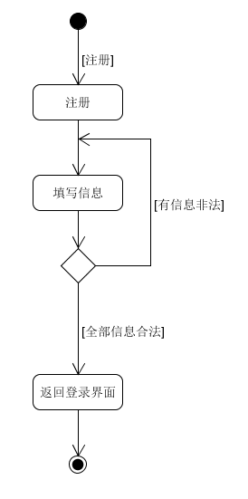
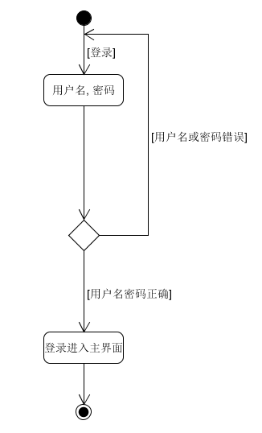
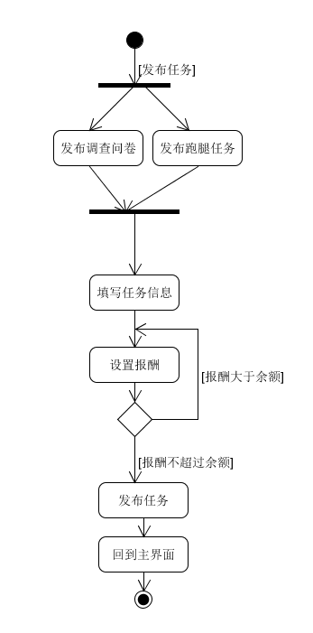
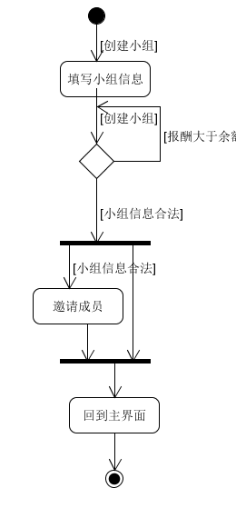

# 主要用例
## 注册
### 主要参与者
未注册用户.
### 前置条件
无.
### 后置条件
数据库设计合理以致新用户信息在用户表中完全合法不造成冲突.
### 主成功场景
用户输入用户信息, 包括必须的用户名密码, 以及不必须的头像电话等. 当全部信息验证合法后注册成功, 返回登录界面登录.
### 交替场景
若注册失败则停留在注册界面重新注册.

## 登录
### 主要参与者
待登录用户.
### 前置条件
用户拥有账户, 记得自己的账号密码.
### 后置条件
无.
### 主成功场景
用户输入用户名密码登录. 当用户名密码全部正确时登录成功, 进入主界面.
### 交替场景
若用户名或密码出现错误则停留在登录页面重新登录.

## 发布任务
### 主要参与者
用户.
### 前置条件
用户已登录, 且拥有足够余额(至少不少于想要支付的报酬).
### 后置条件
转账及时, 即任务发布成功后立即将报酬托管至云端, 避免资金周转出现bug.
### 主成功场景
选择任务类型, 输入任务信息, 支付报酬, 发布任务. 发布成功后返回主界面.
### 交替场景
若发布失败, 包括任务信息非法, 余额不足等情况, 则重新输入非法信息等待发布.

## 创建小组
### 主要参与者
用户.
### 前置条件
用户已登录.
### 后置条件
无.
### 主成功场景
输入小组信息, 若小组信息合法, 可以选择邀请成员, 或者回到主界面.
### 交替场景
重新输入小组信息.

