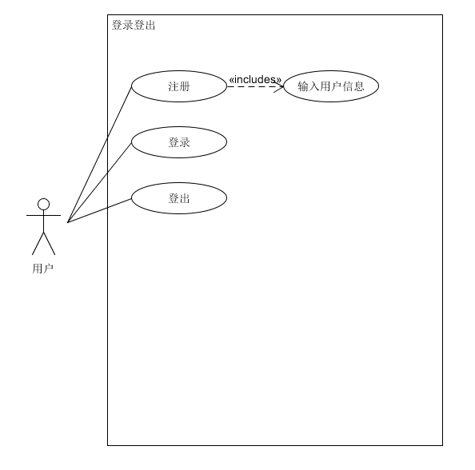
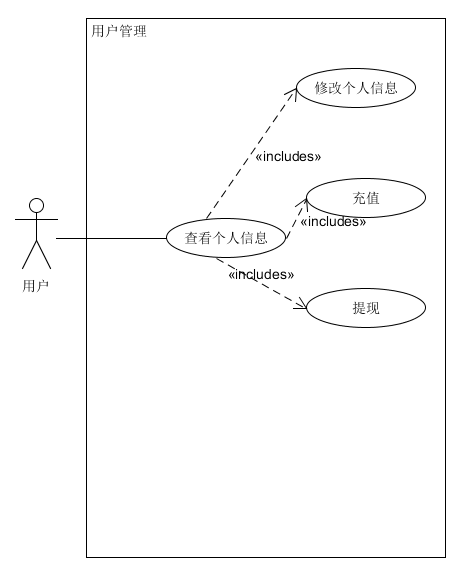
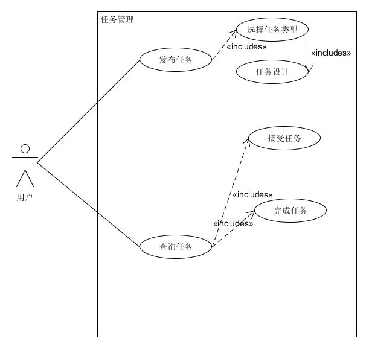
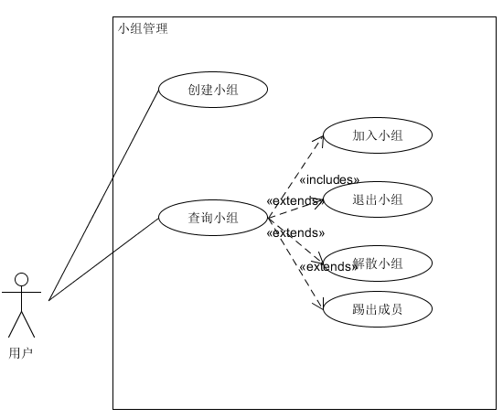

# Week6 2019-3-29（第二次会议记录）

### 会议目标：细化功能、更改部分分工

### 会议时间：2019-3-29

### 会议人员：赵佳乐 张子轩 赵博然 周泽昊

### 会议时间：40分钟

### 会议结果：

* 细化功能，并针对功能进行具体分工 ，全体人员对界面UI提出建议，确定使用上边栏

* 分工修改，周泽昊（原后端）与赵佳乐（原前端）进行调换，调换后结果为：

  * 前端：张子轩、周泽昊
  * 后端：赵佳乐、赵博然

* 项目进展：

  * 前端：设计部分UI界面，完善用例活动图、模型

    

    

    

    
  
  * 后端：设计相关注册登录相关API功能，讨论内容实现,明确数据库建表以及各键、表之间关系，进行了用户注册登录的相关数据库和后端设计（部分数据库内容如下，详见数据库设计07.1)，
  
    ```sql
    CREATE TABLE IF NOT EXISTS `user` (
        `username` CHAR(20) NOT NULL UNIQUE, 
        `password` TEXT NOT NULL, 
        `score` FLOAT NOT NULL DEFAULT 5, 
        `task_complete` INTEGER NOT NULL DEFAULT 0, 
        `money` FLOAT NOT NULL DEFAULT 0, 
        `true_name` CHAR(20) NOT NULL, 
        `school_name` CHAR(45) NOT NULL DEFAULT 'SYSU', 
        `grade` INTEGER NOT NULL, 
        `nickname` CHAR(20), 
        `phone_number` CHAR(14), 
        `account_state` INTEGER NOT NULL DEFAULT 0, 
        `email` CHAR(21), 
        `signature` TEXT, 
        `createdAt` DATETIME, 
        `updatedAt` DATETIME, 
        PRIMARY KEY (`username`)
    ) ENGINE=InnoDB;
    ```
    
    
    
    

