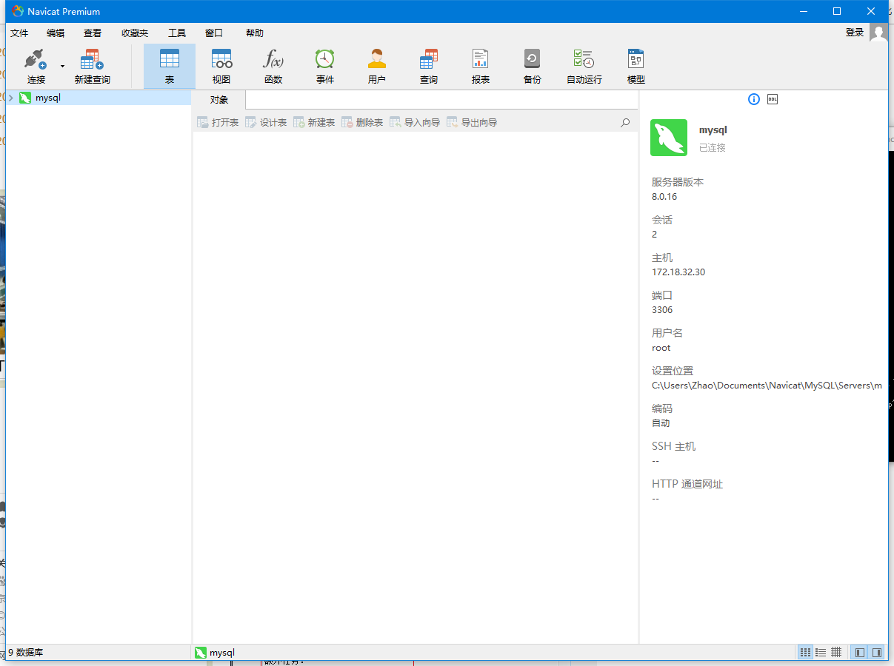
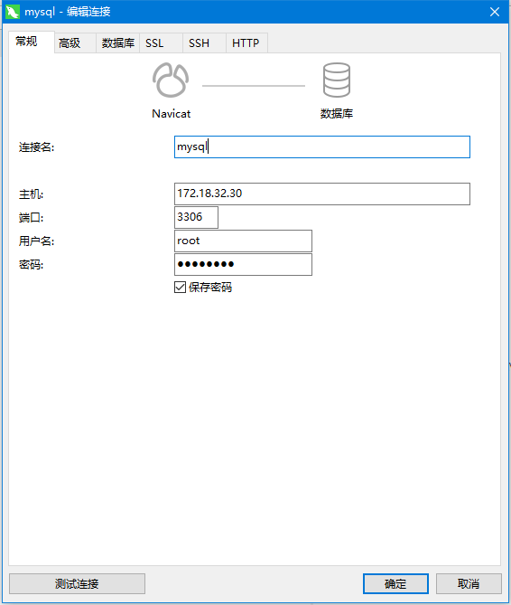
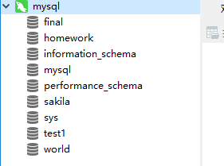
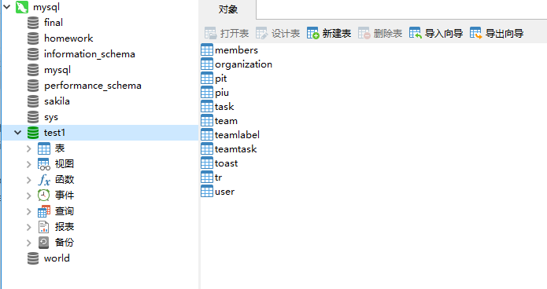
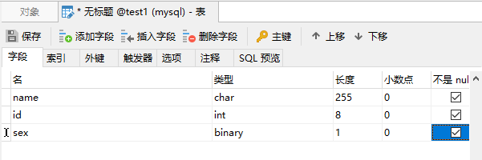
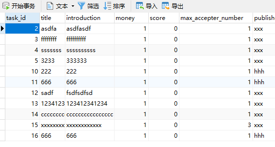

# Navicat Premium的使用
Navicat Premium 是一套数据库开发工具, 让你从单一应用程序中同时连接 MySQL, MariaDB, MongoDB, SQL Server, Oracle, PostgreSQL 和 SQLite 数据库. 它与 Amazon RDS, Amazon Aurora, Amazon Redshift, Microsoft Azure, Oracle Cloud, MongoDB Atlas, 阿里云, 腾讯云和华为云等云数据库兼容. 你可以快速轻松地创建, 管理和维护数据库.

在部署好你的数据库后, 尽管例如Microsoft SQL Server或MySQL Server等提供了数据库管理工具, 但毕竟操作相对繁琐, 有时还需要自己设计查询语句. 在进行这次项目时我发现了Navicat Premium, 一个强大的数据库开发工具.

## 主界面


## 建立连接, 这里我编辑了上图的mysql连接

## 数据库服务器里的数据库列表

## 项目使用了数据库test1, 打开后可以看到已经建好的表

## 可以不通过SQL语句来建表, 同时生成对应的SQL语句


```sql
CREATE TABLE `test1`.`Untitled`  (
  `name` char(255) NOT NULL,
  `id` int(8) NOT NULL,
  `sex` binary(1) NOT NULL,
  PRIMARY KEY (`id`)
);
```

## 可以不通过SQL语句直接查看或修改表中信息.


这次项目具体用到了这些简单的功能, 其他功能可待以后再去发现. Navicat Premium是一款数据库SQL语句苦手程序员也可以轻松上手的数据库管理工具, 我推荐使用.