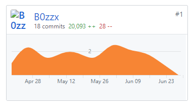
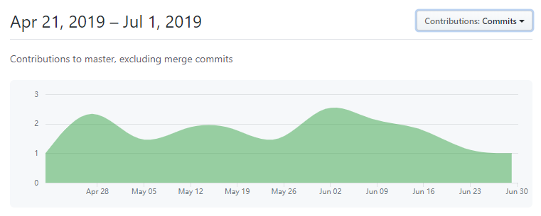

# 个人小结

## 个人简短小结

+ 本人在项目中承担前端工程师的职务，在这次项目实现中使用vue框架进行了前端页面的设计实现，我负责完成了登录、注册、任务发布、任务搜索、用户及充值提款、个人任务情况界面的实现。

## PSP 2.1 统计

| PSP阶段 | 耗时（h） |
|-|-|
| **计划** | 4 |
| 估计项目开发时间 | 4 |
| **开发** | 47 |
| 需求分析 | 3 |
| 设计文档 | 3 |
| 代码规范 | 1 |
| UI设计 | 2 |
| 逻辑设计 | 4 |
| 编码 | 32 |
| 测试 | 2 |
| **报告** | 4 |
| 测试报告 | 1 |
| 计算工作量 | 1 |
| 每次会议后更新计划 | 2 |

## 主要工作清单

+ 最有价值工作：完成ui实现，符合了大家的审美期待。

## 在front-end仓库中的贡献

## 个人博客清单

[网页前端基础学习与使用](https://blog.csdn.net/zzx993539017/article/details/94360620)

[vue学习与使用](https://blog.csdn.net/zzx993539017/article/details/94348667)

[vue-router学习与使用](https://blog.csdn.net/zzx993539017/article/details/94353384)

[iVew学习与使用](https://blog.csdn.net/zzx993539017/article/details/94355084)

[axios学习与使用](https://blog.csdn.net/zzx993539017/article/details/94356504)

[vue中的一些方法介绍](https://blog.csdn.net/zzx993539017/article/details/94355968)

## 特别致谢

+ 感谢项目小组中的其他三个人的付出，项目的成功实现是我们共同努力的结果。