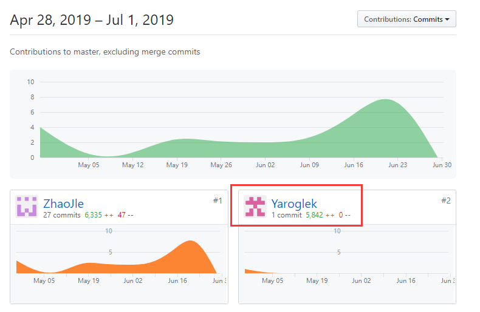
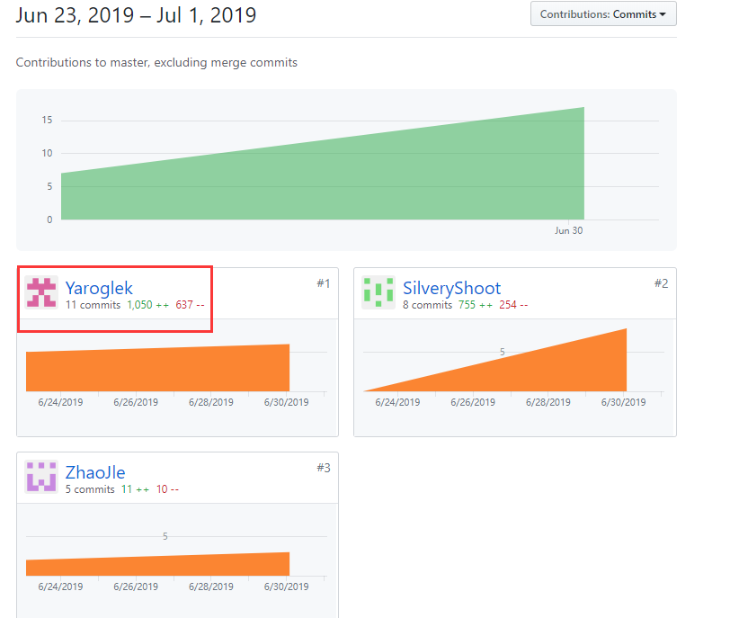

# 个人报告 16340299 赵博然
负责数据库的设计, 后端项目的部署, 项目文档的编写.

## 后端

## 文档

## PSP2.1统计
| PSP阶段 | 耗时(h) |
|-|-|
| **计划** | 5 |
| 估计项目开发时间 | 5 |
| **开发** | 30 |
| 需求分析 | 3 |
| 设计文档 | 3 |
| 代码规范 | 1 |
| UI设计 | 0 |
| 逻辑设计 | 10 |
| 编码 | 11 |
| 测试 | 2 |
| **报告** | 4 |
| 测试报告 | 1 |
| 计算工作量 | 1 |
| 每次会议后更新计划 | 2 |

## 个人博客
[16340299 Navicat Premium的使用](X4-16340299.1.md)