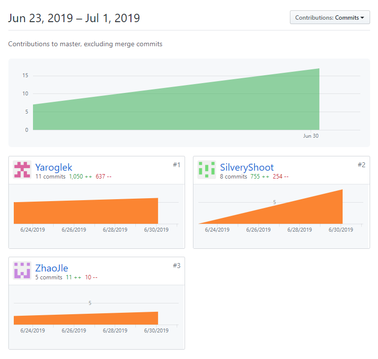
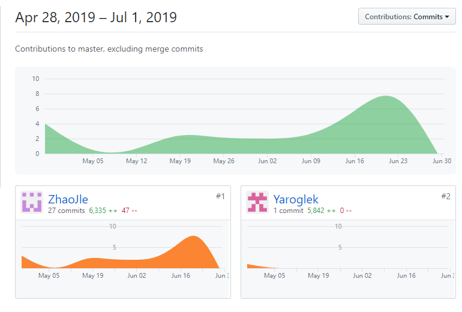
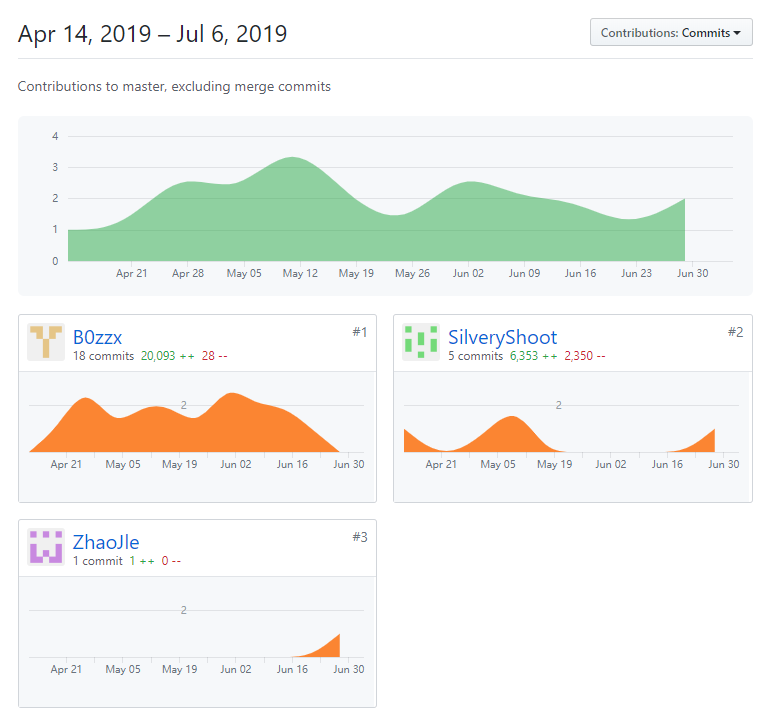

# 个人贡献率说明
## 项目文档

## 后端

## 前端

## PSP2.1汇总

| PSP阶段 | 16340299 | 16340297 | 16340300 | 16340312 |
| :--: | :-----: | :-----: | :----: | :----: |
| **计划** | 5 | 4 | 5 |
| 估计项目开发时间 | 5 | 4 | 5 |
| **开发** | 30 | 47 | 55 |
| 需求分析 | 3 | 3 | 3 |
| 设计文档 | 3 | 3 | 3 |
| 代码规范 | 1 | 1 | 1 |
| UI设计 | 0 | 2 | 0 |
| 逻辑设计 | 10 | 4 | 18 |
| 编码 | 11 | 32 | 25 |
| 测试 | 2 | 2 | 5 |
| **报告** | 4 | 4 | 4 |
| 测试报告 | 1 | 1 | 1 |
| 计算工作量 | 1 | 1 | 1 |
| 每次会议后更新计划 | 2 | 2 | 2 |

## 小组总结
| 制品 | 16340300 | 16340297 | 16340299 | 16340312 |
| :--: | :--: | :--: | :--: | :--: |
| **源代码** | 30% | 30% | 20% | 20% |
| 前端 | 0% | 67% | 0% | 33% |
| 后端 | 67% | 0% | 33% | 0% |
| **分析与设计** | 20% | 30% | 30% | 20% |
| **项目文档** | 10% | 10% | 60% | 20% |
| **综合贡献** | 25% | 25% | 25% | 25% |
